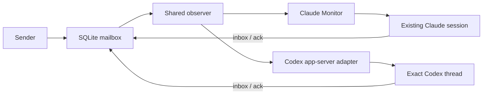

# `hardline-mcp watch` — inbox signals for Claude Code and Codex

Implemented design, revised 2026-09-09. Real Claude Monitor and Codex
app-server wake are verified. Attaching an already-open native Codex client
without a shared app-server endpoint remains host integration work.

## Architecture: one owner for each decision

The mailbox already records unfinished consumption as `acked_at IS NULL`.
Observe that state; send a small attention signal; let the existing session
read its own inbox. No cursor, delivery ledger, heartbeat, or schema migration
is needed.



| Component | Owns |
| --- | --- |
| Mailbox and session registry | Durable unread state and lane claims |
| `watch.py` | Exact snapshot, reminder timing, sequence, bounded recovery |
| Host adapter | Connection, host readiness, delivery acceptance |
| Receiving session | Inbox consumption and interpretation under its current instructions |

The observer never acknowledges mail, registers an owner, initializes a
database, or acts on message bodies. A host accepting a notice does not mean
that the session has consumed the mail.

## Bind identities explicitly

A mailbox target is `(database, agent, MCP PID, creation token)`. Obtain it
from `server_info().watch.argv` in the recipient session, after `list_agents()`.
The descriptor uses the serving Python executable and an absolute database
path. A missing agent or creation token produces a null command with a reason.

Instance observation includes exactly the selected bare agent and all lanes
currently held by that process/token pair. Claims include existing backlog;
releases remove recipients on the next poll. A missing registration never
falls back to watching the bare mailbox alone. A dead or reused PID ends the
watch; an unverifiable process enters bounded recovery.

Bare mail is shared and consumable: two watchers may signal, but another
session can drain the message first. An empty inbox after a notice is normal.

Generic observation also permits explicit complete lanes, such as
`--agent codex --lane codex:construction`. It includes that agent's bare
mailbox and only the supplied qualified recipients. Automatic Codex wake
requires instance binding.

A Codex conversation is a separate target: `(owning endpoint, exact UUID)`.
Its host supplies this together with the mailbox descriptor. A lane, PID,
session name, or shared working directory cannot establish that association.
Preflight validates both targets; it cannot prove an arbitrary pairing supplied
by a caller.

## Read one fresh snapshot

Resolve paths through the existing mailbox resolver: explicit `--db`, then
`HARDLINE_DB`, then the server default. On every poll, open
`target.db.as_uri() + "?mode=ro"` with a short SQLite timeout. Read and close
before contacting the host, printing, or waiting.

```sql
WITH owned AS (
    SELECT lane FROM agent_sessions
    WHERE pid = :pid AND process_key = :key AND agent = :agent
), recipients AS (
    SELECT :agent AS recipient UNION SELECT lane FROM owned
)
SELECT EXISTS(SELECT 1 FROM owned), EXISTS(
    SELECT 1 FROM messages
    WHERE recipient IN (SELECT recipient FROM recipients)
      AND acked_at IS NULL
);
```

Validate registration before interpreting unread state. The query uses the
existing process and recipient indexes. Explicit lanes use a parameterized
`EXISTS` query with the same unread condition.

Fresh connections handle replacement at the same path and message IDs
restarting from zero. Do not retain a connection across polls or add inode
tracking. Do not use `immutable=1` for a changing WAL database. Read-only
observation can still involve SQLite's WAL sidecars; the guarantee concerns
application tables and schema.

Avoid the store's initializing or pruning helpers: `mailbox._connect`,
`mailbox.inbox`, `sessions.live`, and `sessions.holders`.

## One reminder clock, one host callback

The observer calls `poll(notice)` once per successful snapshot. It passes
`None` when there is no due notice. The callback still validates its host
during quiet polls and returns true only when it accepts a notice.
The stdout callback simply ignores `None`.

| Observation or result | Observer transition |
| --- | --- |
| Empty inbox | Clear the reminder deadline |
| Unread, no deadline or deadline reached | Offer one notice |
| Notice accepted | Advance sequence; set deadline to now + reminder interval |
| Host busy or notice deferred | Keep sequence and deadline |
| Observation unavailable | Preserve attention state; retry within the recovery window |

A backlog of thousands of messages yields one notice. An observed empty inbox
re-arms immediately, so fresh mail does not wait behind a prior successful
wake. If a drain and refill occur entirely between polls, the normal reminder
eventually recovers attention.

```json
{"event":"mail_pending","agent":"codex","sequence":1}
```

Sequence numbers are local to a watcher. The signal contains no body, sender,
preview, arbitrary label, or new task instruction.

The Codex adapter has one additional deadline, solely for an unresolved
submission. Reserve it before sending. A valid acceptance, matching rejection,
or observed empty inbox clears it. A lost reply retains it across reconnection
until the deadline or one of those observations resolves the uncertainty.

The observer passes both the due notice and its observed `pending` state to
the adapter. No notice does not imply an empty inbox: a quiet preflight or
backlog awaiting its reminder also produces no notice. An explicit empty
snapshot clears uncertainty before querying the host, so host unavailability
cannot erase that observation. A rejected status query or malformed reply
does not resolve a prior submission. These distinctions bound duplicate
retries while allowing fresh mail and rejected submissions to retry promptly.
Notices can repeat; a lost reply can duplicate a hint.

## Codex connection and delivery

`wake_codex.py` accepts an explicit loopback WebSocket URL and exact UUID.
Initialize with experimental API support and require the connected server's
`userAgent` to report a stable version >= 0.153.4, our verified compatibility
floor. Older servers can silently ignore `toolOutput` while accepting a turn;
unknown and prerelease versions also fail before attachment or submission.
This checks the owning runtime, not a separate CLI on PATH.

Find that UUID through `thread/loaded/list`, then check
`thread/read(includeTurns=false)` once per poll. Paginate loaded threads
without guessing by name or reading history.

Any failed exchange closes the connection, including rejected attachment and
protocol errors. A subsequent connection must initialize and validate again.
A partially initialized socket is never reusable.

For a due notice, defer if the thread is active or an uncertain submission
is cooling down. Otherwise recheck unread mail, then submit:

```json
{
  "method": "turn/start",
  "id": 17,
  "params": {
    "threadId": "<exact thread UUID>",
    "input": [],
    "toolOutput": {
      "name": "hardline_watch",
      "namespace": null,
      "output": "{\"event\":\"mail_pending\",\"agent\":\"codex\",\"sequence\":1}"
    }
  }
}
```

The runtime starts generation when idle and queues tool output into an active
regular turn. This handles a user starting work between the status check and
submission. [OpenAI app-server protocol](https://learn.chatgpt.com/docs/app-server#start-a-turn)

Use one request in flight, match reply IDs, and bound RPC waits to five seconds.
Notifications are not delivery receipts. Unknown/unloaded targets stop the
adapter; unexpected approval or input requests are surfaced, never answered
on the user's behalf. The owning host retains approval and UI handling.

The adapter supplies no model, permissions, or working-directory overrides.
It never creates, resumes, or interrupts a thread. `codex exec`,
`deliver=true`, and stdout alone do not address an existing conversation.

## Arming and lifecycle

`hardline-mcp` without arguments and `python -m hardline_mcp.server` still
serve MCP over stdio. CLI dispatch imports the chosen command lazily.
The generic watcher has no new dependency; Codex requires the
`codex-watch` extra. Reinstall after changing console entry points.

```text
hardline-mcp watch --agent AGENT --db PATH
    (--owner-pid PID --owner-key TOKEN | --lane AGENT:LABEL ...)
    [--interval SECONDS] [--remind-after SECONDS] [--once]

hardline-mcp watch-codex --endpoint URL --thread UUID
    --db PATH --owner-pid PID --owner-key TOKEN
    [--interval SECONDS] [--remind-after SECONDS] [--check]
```

| Setting | Contract |
| --- | --- |
| Poll interval | Default 1 s; finite, 0.2–60 s |
| Reminder interval | Default 30 s; finite, 5–3600 s and at least the poll interval |
| Recovery | Up to 30 s of continuous unavailability; bounded waits |
| `watch --once` | One observation; print a notice if unread |
| `watch-codex --check` | Validate owner and connection without starting a turn |
| Exit codes | 0 success/cancellation/closed stdout; 1 error; 2 invalid arguments; 3 lost target |

Diagnostics go to stderr on bounded, escaped lines. `observer_ready` means a
valid mailbox snapshot; `wake_connected` means the exact host thread was
found. Only an actual live experiment proves wake.

Claude Code uses one persistent Monitor running `watch.argv`. The Codex host
supervises one adapter for its bound thread, retains a stop handle, and exposes
diagnostics. Use hidden windows for Windows helpers. Stop old helpers and
obtain fresh identities after an MCP reconnect; never persist a PID or token
as project configuration.

On `mail_pending`, the receiving session drains its own
`inbox(agent=...)` until `remaining=0`, uses `peek` for truncated bodies,
and applies its current instructions before acting. Setup commands and standing
instructions live in [README.md](../README.md#inbox-signals-for-existing-sessions)
and [CLAUDE.md](../CLAUDE.md). Existing `AGENTS.md` is preserved.

## Verification and measured boundaries

Deterministic tests use real temporary SQLite databases, fake clocks/process
probes, and a loopback WebSocket peer. They cover exact scope, claim/release,
missing owners, replaced or locked stores, reminders, quiet output, deferred
delivery, failed attachment, uncertain replies, and both MCP entry points.

Live tests launch isolated clients and their real MCP servers. The harness
sends test mail under the opposite agent's name; the sender is not another
model. No test attaches to the operator's existing work.

Initial acceptance on Windows, 2026-09-09:

| Control | Claude Code 2.1.260 streaming CLI | Codex 0.153.4 app-server WebSocket |
| --- | --- | --- |
| Send to real inbox consumption | 5.722 s initial; 6.483 s repeat | 8.802 s initial; 10.601 s with observer |
| Scheduling detail | Includes Monitor and model/tool execution | Initial adapter acceptance: 0.243 s |
| Foreign bare/lane mail; silence after drain | No turn for 31 s | Neither of two threads sharing cwd starts a turn for 31 s |
| Busy recipient | Not separately measured live | 32 messages while a host tool is blocked produce one deferred notice |
| Stopped helper | Mail unread; no turn for 31 s | Mail unread; no turn for 31 s |
| Restart with backlog | Deterministic observer coverage | Drains in the original thread |
| Injected database/process/protocol failures | Deterministic coverage | Deterministic coverage; not all injected into a live model |

Both clients used serving Python 3.13.13. After the design pass, the full suite
passes 464 tests on both Python 3.10 and 3.13, with 12 expected skips each.
Twelve isolated mutations are caught. Linux CI was not run from this Windows
session. Both live cases passed again after the refactor: Claude consumed mail
in 6.653 s and Codex in 12.716 s, with their isolation, stopped-helper, and
Codex busy/restart controls passing.

Regression coverage now includes immediate re-arming after a successful wake,
discarding failed attachment, one host check per poll, and silent one-shot
observation of an empty inbox. Both reproduced defects failed their tests
before the changes.

Run the normal suite with `python -m pytest -q -rs`. To reproduce live
acceptance after installing `.[dev,codex-watch]`, set
`HARDLINE_LIVE_WATCH=1` and run
`python -m pytest tests/test_live_watch.py -v -s`. These tests consume plan
tokens and are disabled in ordinary CI.

A native `codex queue --thread UUID` probe queued during work subsequently
arrived in the same existing CLI conversation and was acknowledged. This
proves busy-to-next-turn delivery for that probe, not already-idle wake or
duplicate handling. It did not exercise the mailbox observer.

The inspected native CLI exposed no loopback endpoint; desktop app-server
processes used stdio. The Unix-only daemon lifecycle command does not disable
Windows queueing. Native CLI/desktop attachment, further transports, and
universal latency guarantees remain outside the verified deployment. Expose or
integrate the owning host connection, then run the same controls there.
